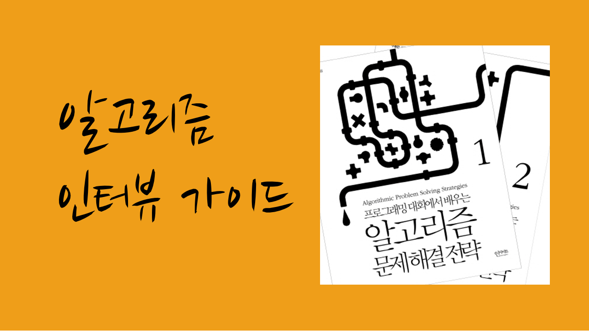

# 면접의 원칙들

가장 중요한 원칙은 자신이 생각하는 과정을 **입 밖으로 내서 말하는 것이다.** 좀 헤매더라도 상관 없으니, 능동적으로 문제를 해결해 나가는 과정을 보여주는 것이 중요하다. 물론 쉼없이 떠들어야 한다는 말은 아니다. 첫 마디를 꺼내기 전에 잠깐 멈춰서 무슨 말을 할 지 되새김질 해 보면 도움이 된다.

- 문제를 단순화 시키기

    두 개의 변수를 정하는 문제 -> 한 개를 고정하고 다른 한 개만 찾기
    입력의 크기 -> 간단하게 줄이기
    “문제가 쉽지 않은데, 이렇게 더 간단한 버전부터 풀어 보고 이걸 일반화할 수 있을지 한 번 보는 것이 좋을 것 같습니다.”
- 효율적인 알고리즘 찾기

    간단하고 비효율적인 방법 -> 그것을 최적화해 나가는 방법
    “이 문제를 푸는 가장 단순한 방법은 ~겠네요. 그런데 이 방법의 시간 복잡도는 ~라서 너무 느린데, ~부분을 ~자료 구조를 대신 써서 최적화 하면..”
- 비슷한 문제 경험

    혹시라도 비슷한 문제를 들어 본 적이 있다면,
    “오, 그거랑 비슷한 문제를 과거에 들어본 적이 있네요. 그 문제는 ~해서 풀었는데, 이 문제의 답과 연관이 있을 것 같습니다.”
    라고 시작하면 된다.
- 적절한 가정 혹은 질문하기

    입력의 크기는 얼마나 되는지, 얼마나 빨리 수행해야 하는 일인지, 메모리는 얼마나 사용해도 되는지 등

# 알고리즘 설계 및 구현하기

화이트보드에 코드를 작성하여 설명해야되기 때문에 미리 연습해 두는 것이 좋다.

### 배열 조작 관련 알고리즘

- 정렬 알고리즘

    퀵소드, 머지소트 구현, 이들의 공통점( 둘다 분할 정복 알고리즘), 차이점 (퀵소트는 분할 과정이 복잡, 머지소트는 병합 과정이 복잡)
- 이분 탐색 알고리즘

    구현하기 까다로우니 신경써서 한번 구현해 보면 좋다.
- k번째 원소 선택 알고리즘

    퀵소트의 응용판인데 아주 유용하다. 원리를 이해해 두면 다른 문제 푸는데도 여럿 응용 가능하다.

### 자료 구조

- 스택, 큐
- 해시
    ~에서 ~를 빠르게 찾으려면 어떻게 할까요? -> “해시 쓰면 안되나요?”
- 이진 트리
    ~에서 ~보다 작은/큰 원소를 빠르게 찾으려면 어떻게 할까요? -> “이진 트리 쓰면 안되나요?”
해시나 이진 트리는 특성이나 시간 복잡도를 잘 공부해 두는 것이 좋다.

### 그외 준비할 것

- 재귀 호출: 길이 N인 모든 순열 생성하기, 미로에서 길 찾기
- 시간 복잡도 분석