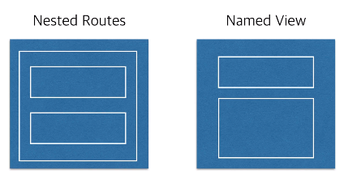

# Nested Routes
특정 URL에서 1개의 컴포넌트에 여러 개의 하위 컴포넌트를 갖는 것

# Named View
특정 URL에서 여러 개의 컴포넌트를 쪼개진 뷰 단위로 렌더링 하는 것
* 라우터로 특정 URL로 이동시, 해당 URL에 해당하는 여러 개의 View(컴포넌트)를 동시에 렌더링 한다.
* 각 컴포넌트에 해당하는 `name`속성과 `router-view`지정 필요
```html
<div id="app">
	<router-view name="nestedHeader"></router-view>
	<router-view></router-view>
</div>
```
```js
{
	path : '/home',
	// Named Router
	components: {
		nestedHeader: AppHeader,
		default: Body
	}
},
```
router-view에 설정한 ‘nestedHeader’라는 이름으로 AppHeader 컴포넌트가 불러와지고, default 값으로 Body를 주었으므로 Body태그로 컴포넌트가 띄워진다. 따라서 Named View는 name 속성을 지정해 주어서 그 이름에 맞게 바로 렌더링이 된다.