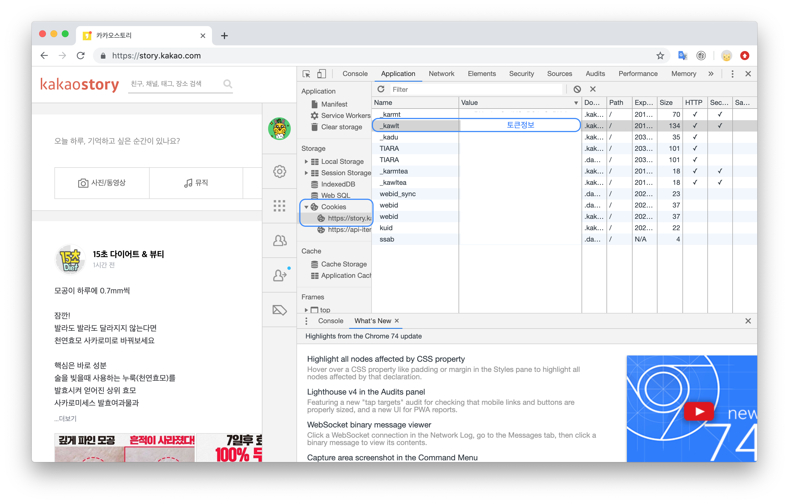

## 토큰 기반 인증방식
토큰은 고유 식별자로 토큰을 만들어서 client에게 전달하는 방향으로 진화했기에 토큰만 전달된다면 다양한 포맷(JSON, XML등)의 구분없이, 상태와 상관없이(stateless) 폭넓게 사용될 수 있다. 

인코딩 방식.[https://www.urlencoder.org/](https://www.urlencoder.org/)

주로 쿠키에 저장. 기간이 정해지지 않은 것은 세션쿠키(N/A)
쿠키에 저장할 경우, 브라우저에서 요청이 들어오면 자동으로 쿠키를 같이 보내줌. 쿠키에 있는 토큰을 통해 서버에서 인증.

예시 - 카카오 스토리

---

**다른 글**  
[CS(Computer Science) 정리](https://groovypark.github.io/2018/05/18/CS%EA%B3%B5%EB%B6%80/)  
[자료구조 정리](https://groovypark.github.io/2018/11/15/%EC%9E%90%EB%A3%8C%EA%B5%AC%EC%A1%B0-%EC%A0%95%EB%A6%AC/)

**참고**  
[https://behonestar.tistory.com/37](https://behonestar.tistory.com/37){:target="_blank"}